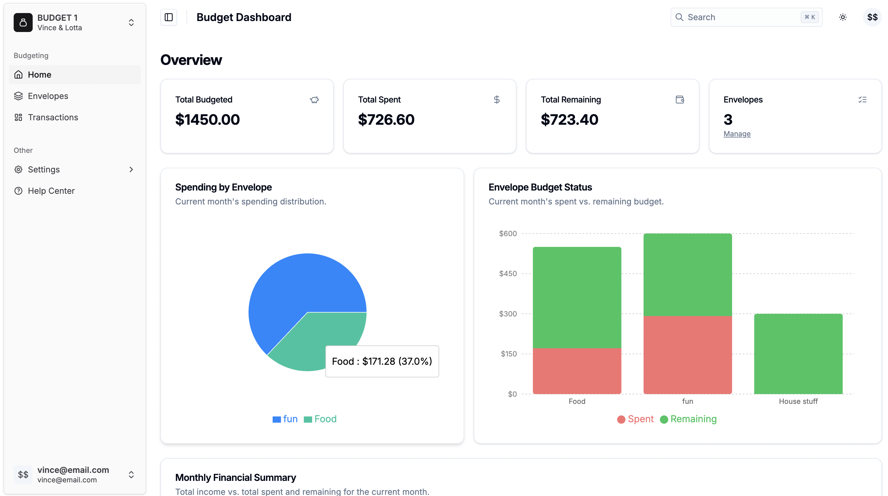

# Vibe-Coded Envelope Budgeting App

A full-stack envelope budgeting application vibe-coded using
- [Wasp](https://wasp.sh), a React, Node.js, and Prisma full-stack framework.
- [Shadcn-Admin](https://github.com/satnaing/shadcn-admin) for the UI.
- Cursor with Google Gemini 2.5 Pro for AI-assisted development.

This project serves as a demo for using Wasp with AI-assisted development tools like Cursor, Windsurf, Copilot, Claude Code, etc.



## Getting Started

1. install Wasp

```bash
curl -sSL https://get.wasp.sh/installer.sh | sh
```

2. start a postgres database (you must have [docker installed](https://www.docker.com/get-started/))

```bash
wasp start db
```

3. migrate the database

```bash
wasp db migrate-dev
```

4. start the development server

```bash
wasp start
```

## AI-Assisted Development

This project leverages AI tools to streamline development through:

### `.cursorrules` File

The `.cursorrules` file contains project-specific conventions and best practices that guide AI assistants (like GitHub Copilot or Cursor AI) when suggesting or generating code. It includes:

- Wasp project structure and patterns
- Import rules and common issues
- Database schema guidelines
- Authentication configuration
- Operation implementation patterns

### `ai` Directory

The `ai` directory serves as a knowledge base for the project:

- `ai/plan.md`: Outlines the phased implementation roadmap
- `ai/prd.md`: Contains product requirements
- `ai/docs/*.md`: Phase implementation summaries that document decisions, challenges, and implementation details

These documents help AI assistants understand the project context when assisting with code generation, debugging, or feature implementation, creating a more effective collaboration between developers and AI tools.